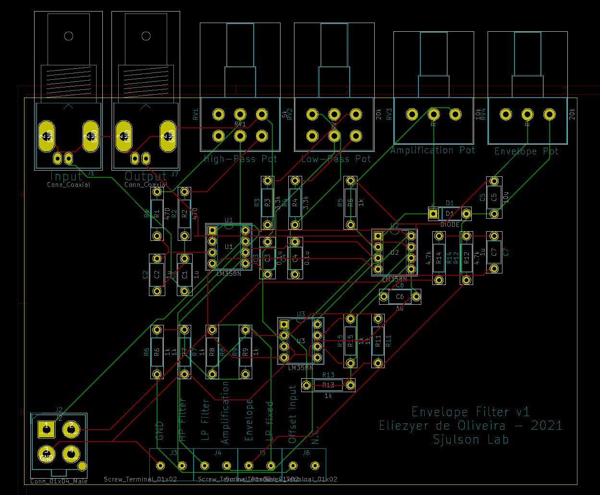

# Analog SWR detection

This repository contains the schematics and PCB design of a circuit that implements a set of filters for sharp wave-ripple detection. It consists of a band-pass filter followed by an envelope low-pass filter. 

The circuit includes the possibility of offsetting the signal to use with the analog-digital converters of other devices for detection (Arduino and Raspberry Pi).

By adapting the components of this circuit, you can detect other events, such as gamma oscillations or spindles.

The main content of this repository is found in the folder analaog_SWR_detection. Everything was designed using the free software [KiCad](https://www.kicad.org/)

The file analog_swr_dection.sch contains the circuit schematics, and the file analog_SWR_detection.kicad_pcb can be used to fabricate a printed circuit board.
